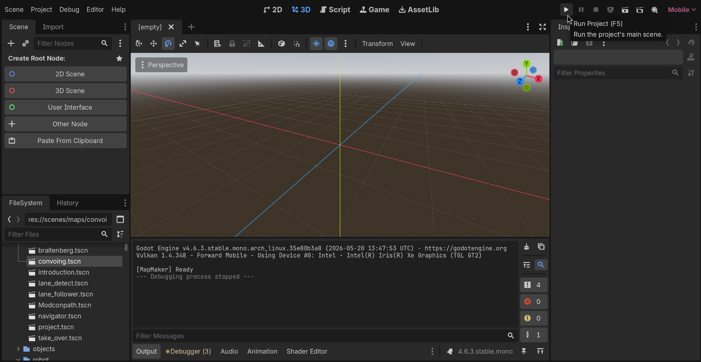
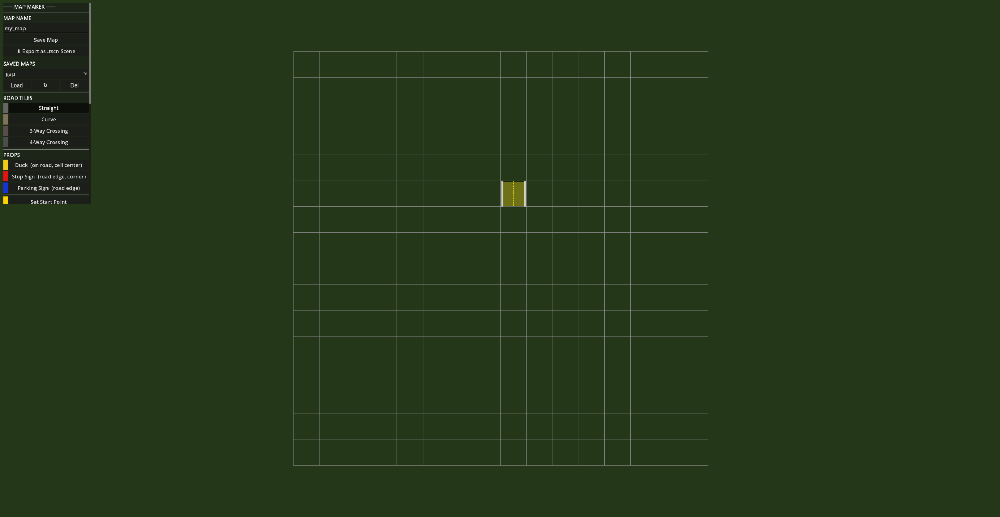
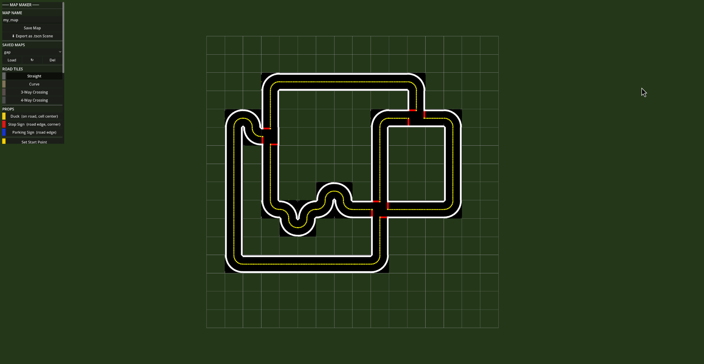
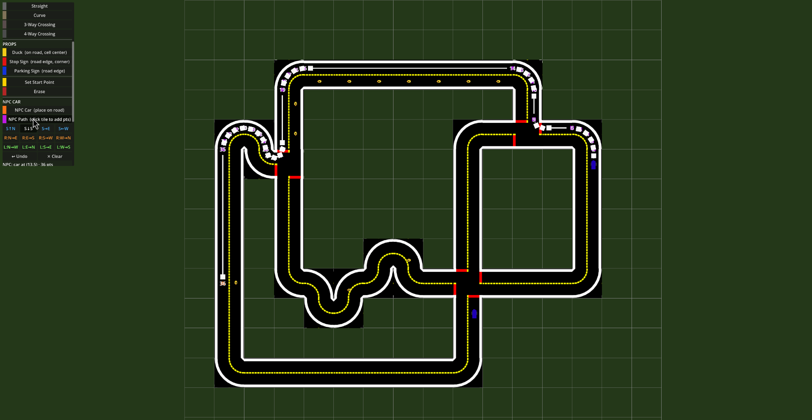
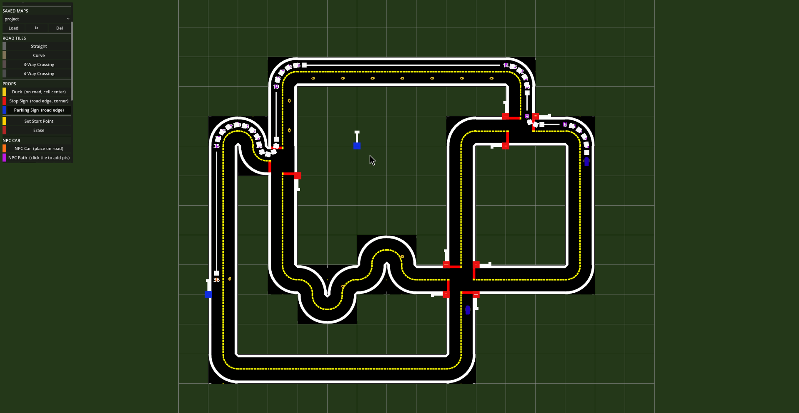
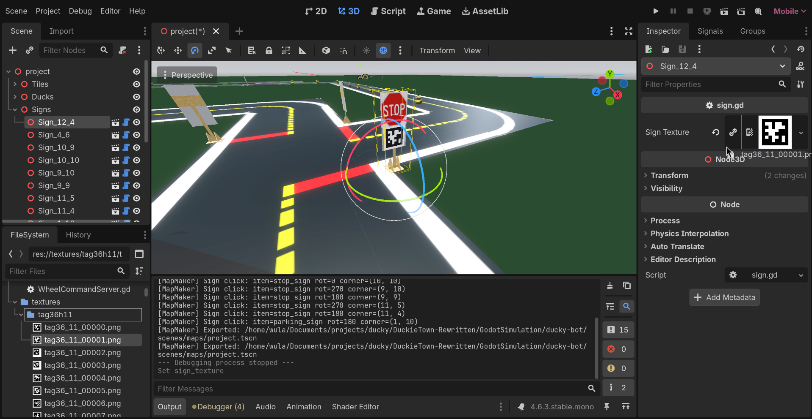
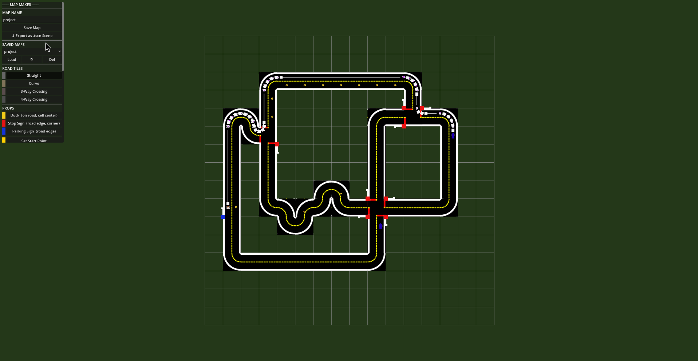
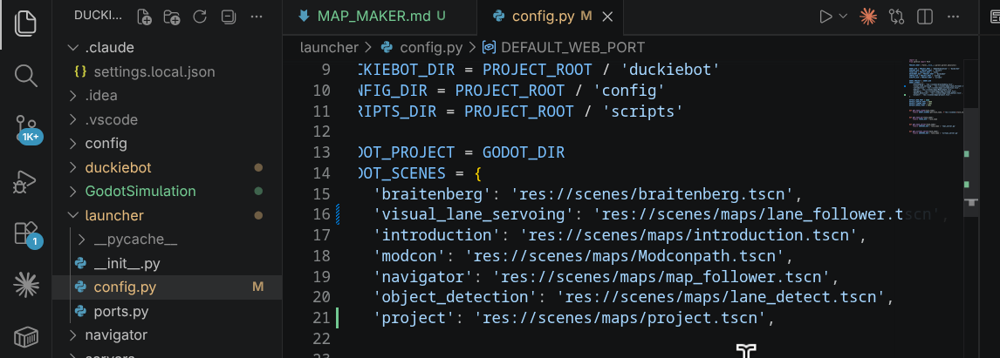

# DuckieTown Map Maker Guide

The Map Maker is a built-in visual editor for designing road maps used in the DuckieTown simulation.


## 1. Install Godot

Download **Godot 4.6** (standard version, not Mono) from the official site:

https://godotengine.org/download/archive/4.6-stable/

Install it and make sure you can launch it from your system.


## 2. Open the Project

1. Open Godot
2. Click **Import** → navigate to `GodotSimulation/ducky-bot/` → select `project.godot`
3. Click **Import & Edit**
4. Click the start button in the top right corner



## 3. Map Maker Overview

The Map Maker opens with a top-down grid view on the left and a control panel on the right.




## 4. Building Roads

Select a road tile type from the panel on the right:

| Tile | Description |
|------|-------------|
| **Straight** | A straight road segment |
| **Curve** | A 90° turn |
| **4-Way** | Full intersection |
| **3-Way** | T-intersection |

- **Left-click** on a grid cell to place a tile
- **Click and drag** to paint multiple tiles at once
- **Right-click** to erase a tile
- Press **R** to rotate the selected tile before placing



## 5. Placing Ducks

Select **Duck** from the object panel.

- Place ducks on any road cell they appear offset into the driving lane
- Press **R** to change the duck's facing direction before placing
- A ghost preview shows exactly where and how the duck will be placed


## 6. Start Bot

Select **Start Bot** from the panel to set where the player's Duckiebot spawns.

- Only one start position can be set at a time
- Press **R** to rotate the spawn direction (this is the direction the bot faces at start)
- Use the right side of the road, since that is the law

## 7. NPC Bot

Select **NPC Car** to place the autonomous NPC vehicle.

- Place the NPC car on any road cell to set its starting position
- After placing, you can define a **path** for it to follow by clicking waypoints on the road
- The NPC will loop along the path continuously at a constant speed
- There can only be one NPC bot for now



## 8. Signs

Signs are placed at road corners (intersections between tiles), not in the center of cells.

Select **Stop Sign** or **Parking Sign** from the panel, then click a corner point on the grid.

- A ghost indicator shows the sign position and direction before placing
- Press **R** to rotate the sign



### Adding a Texture to a Sign

Each sign has a flat texture panel on it. To assign an image (e.g. an AprilTag):

1. Export your map first (so the sign scenes exist in the project)
2. Open the scene in the Godot editor (`scenes/maps/<your_map_name>.tscn`)
3. Select the sign node and drag any `.png` image from the FileSystem panel into the **Sign Texture** field (AprilTag textures are in `textures/tag36h11/`)
4. The texture appears on the sign panel automatically



> **Note:** Each sign instance in an exported map has its own unique texture — assigning a texture to one sign does not affect others.

## 9. Saving and Exporting

### Save (JSON)
Click **Save** to save your current map as a JSON file.
- The file is stored in the Godot user data folder (`~/.local/share/godot/app_userdata/Ducky Bot/maps/`)
- This is the map maker's own working format it preserves everything so you can keep editing later

### Export (.tscn)
Click **Export** to generate a Godot scene file from your map.
- The `.tscn` file is written to `GodotSimulation/ducky-bot/scenes/maps/<map_name>.tscn`
- This is what the simulation actually loads when you run a task

> Save and Export are separate steps. Always export after saving if you want to run the updated map.




## 10. Connecting to the Simulation

After exporting your map, tell the launcher which scene to load by editing `launcher/config.py`:

```python
GODOT_SCENES = {
    'project': 'res://scenes/maps/my_map.tscn',
    ...
}
```

Then run the simulation normally:

```bash
python launch.py --sim --task project
```

> If you don't have a virtual server for your task, it will not run create one similar to the servers in the other task folders.



## 11. Pre built map

Some pre bilt maps were made for some project you can try convoing, take_over and navigator and test your project


## 12. Bugs

If you find any bugs, contact Davit Tsulaia. This map maker was made in one week so it is not perfectly polished the lead developer has a game jam to WIN.
